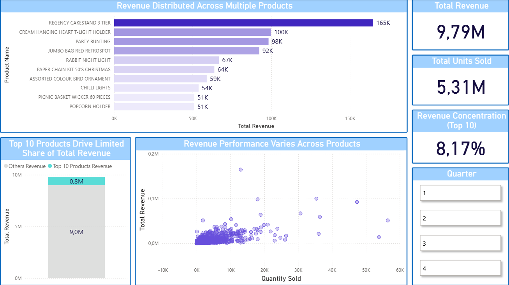
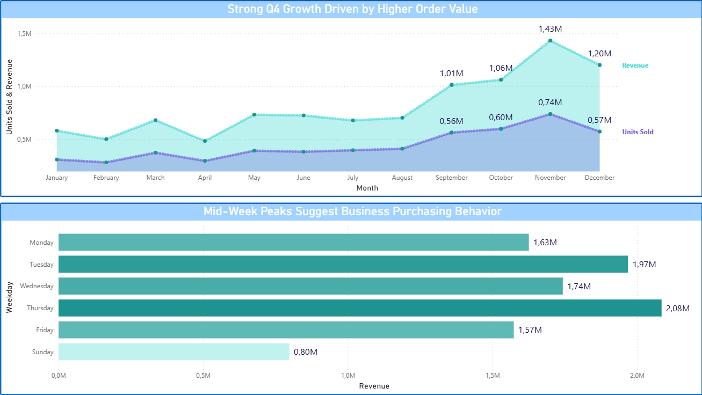
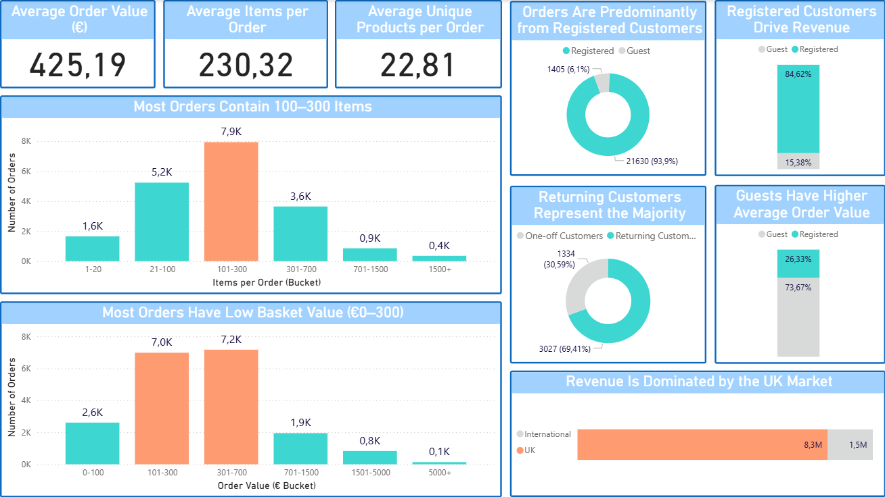
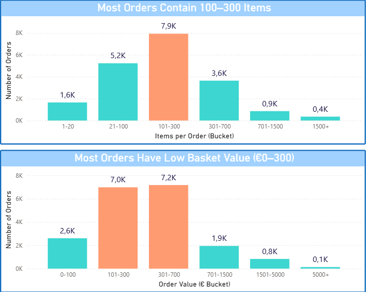
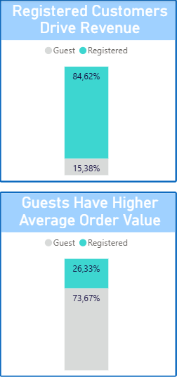

# Customer Behavior & Basket Analysis – End-to-End Data Project

## Overview
This project started as a SQL analytics exercise and evolved into a full end-to-end data workflow, transforming messy transactional data into a structured analytical model and an interactive Power BI dashboard.

The objective is to simulate a real-world data pipeline:
raw data → cleaning & validation → analytical modeling → business insights

---

## Dataset
Public online retail dataset (~500k rows).

- Each row represents a product line within a customer invoice  
- One invoice may contain multiple products  
- Data includes quantities, prices, timestamps, and country  

---

## Business Objective
The goal is to transform raw transactional data into a reliable analytical model and extract meaningful business insights.

Key questions addressed:

- What is the typical basket size and value?
- Do customers behave like individual buyers or businesses?
- How is revenue distributed across customer types?
- Are there patterns of bulk purchasing behavior?
- Which segments and markets drive revenue?

---

## Data Pipeline

### 1. Raw Layer
**raw_online_retail**

- Direct CSV ingestion  
- No transformations applied  
- Preserves original data for traceability  

---

### 2. Staging Layer
**stg_transactions**

Transformations applied:

- Parsed text-based dates into datetime format  
- Converted price fields into numeric values  
- Removed non-product rows (fees, postage, adjustments)  
- Applied filtering after parsing to avoid casting issues  

---

### 3. Data Cleaning & Validation (NEW)

To ensure reliable analysis, additional data validation steps were implemented:

#### Return Handling
- Identified return transactions using invoice patterns (prefix "C")
- Matched returns to original purchases using invoice number proximity (±5 range)
- Validated matches based on:
  - equal and opposite quantities
  - equal and opposite revenue
- Flagged and excluded confirmed return pairs from analysis

#### Outlier Handling
- Applied a percentile-based approach to identify extreme values  
- Flagged only the most extreme low and high cases (conservative filtering)  
- Prevented distortion in basket size and revenue analysis while preserving valid transactions    

---

### 4. Fact Tables

#### fact_transactions
- Grain: product × country × day  
- Metrics:
  - total_quantity  
  - total_revenue  

Supports product performance and time-based analysis  

---

#### fact_receipts
- Grain: invoice (receipt)  
- Metrics:
  - total_items  
  - receipt_revenue  
  - distinct_products  

Supports basket-level and customer behavior analysis  

---

### 5. Dimension Tables

#### dim_product
- One row per product  
- Deduplicated using product_id  

#### dim_date
- One row per date  
- Includes year, month, quarter, weekday  

---

## Feature Engineering

Additional analytical features were created for BI:

- Basket Size Buckets (items per order)  
- Basket Value Buckets (€ per order)  
- Customer Type segmentation (Registered vs Guest)  
- Outlier flag for controlled analysis  

---

## Key Insights

- Most orders contain **100–300 items**, indicating medium-to-large basket sizes  
- Most orders fall within **€0–300**, despite large item counts  
- This suggests **bulk purchasing of low-priced products**  
- Customer behavior resembles **small business / B2B patterns** rather than individual consumers  
- Registered customers dominate both **order volume and revenue contribution**  
- The UK market drives the majority of total revenue  

---

## Dashboard

The Power BI dashboard focuses on:

- Basket size and value distribution (histogram-style analysis)  
- Customer segmentation  
- Revenue contribution by market  
- Behavioral patterns across orders  

## Dashboard Preview

### Page 1 – Product Performance Overview

### Page 2 – Sales Trends & Purchasing Patterns

### Page 3 – Customer Behavior & Basket Analysis

---

## Key Insights (Visual Highlights)

### Bulk Purchasing Behavior Driven by Low-Value Items

### Revenue Driven by Registered Customers, Higher Value per Order from Guests

---

## SQL Queries

This repository includes SQL scripts used for:

- Data cleaning and transformation  
- Return matching logic  
- Outlier detection and filtering  
- Fact and dimension table creation  

---

## Tools & Skills

- SQL (MySQL)
- Power BI (data modeling, DAX, visualization)
- Data cleaning & validation
- Analytical thinking & business interpretation

---

## Key Learnings

- Real-world datasets require explicit validation (returns, anomalies)  
- Data cleaning decisions directly impact analytical outcomes  
- Different analytical questions require different data grains  
- Structured modeling enables scalable BI reporting  
- Insight generation is as important as technical implementation  

---

## Conclusion

This project demonstrates the ability to transform raw transactional data into structured, reliable, and insight-driven analysis, bridging the gap between data engineering, analytics, and business decision-making.
